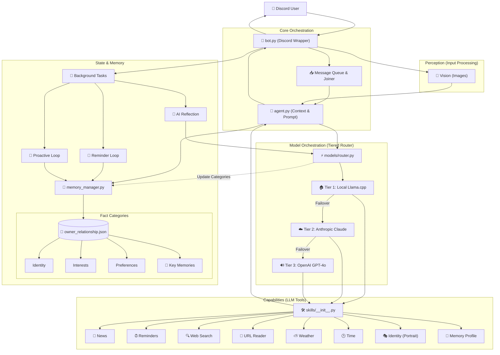

# 🏗️ System Architecture Overview

This diagram visualizes how the bot processes messages, routes between AI models, and manages persistent, categorized memory.

### 🗝️ Key Components

| Component | Responsibility |
| :--- | :--- |
| **`bot.py`** | **Ingestion & UI**: Handles Discord connection, message queuing, and downloads vision attachments. Runs background proactive loops. |
| **`agent.py`** | **Context & Multi-modal Orchestration**: Formats the system prompt by combining **Identity Traits**, **Categorized Facts**, and **Recent Raw Exchanges** for immediate context. |
| **`models/router.py`** | **Tiered Strategy**: Decides which model to use (Llama, Claude, GPT-4o) based on complexity and image data. Handles failovers and tool execution. |
| **`memory_manager.py`** | **Atomic Persistence**: Manages JSON knowledge stores and performs **async, atomic disk writes** via temp-and-swap to prevent data corruption. |
| **`skills/`** | A modular directory with **8+ core tools**: Time, Weather, Web Search, News, Reminders, Brain Profile, Identity Moods, and Link Reader. |
| **`models/`** | Specific API wrappers and vision logic. Each provider (Claude, OpenAI, Local) implements its own extraction tool schema. |
| **`prompts.py`** | Stores the core personality (System Prompt), proactive logic, and the background memory extraction template. |

### 🔄 The Message Flow

1.  **Ingest**: `bot.py` batches rapid user messages into a single thought session.
2.  **Context**: `agent.py` pulls categorized memories and injects the **Last 5 Raw Turns** into the prompt.
3.  **Think**: `router.py` selects the best model tier (Local -> Cloud) for the request complexity.
4.  **Act**: The LLM executes **Skills** (e.g., searching or reading links) to fetch real-world data.
5.  **Reflect**: After each reply, a background task performs **AI Reflection**. It extracts new facts and **One-Sentence Key Memories** to update the categorized facts.
6.  **Commit**: The `MemoryManager` flushes updates atomically to `owner_relationship.json`, ensuring consistency across reboots.
