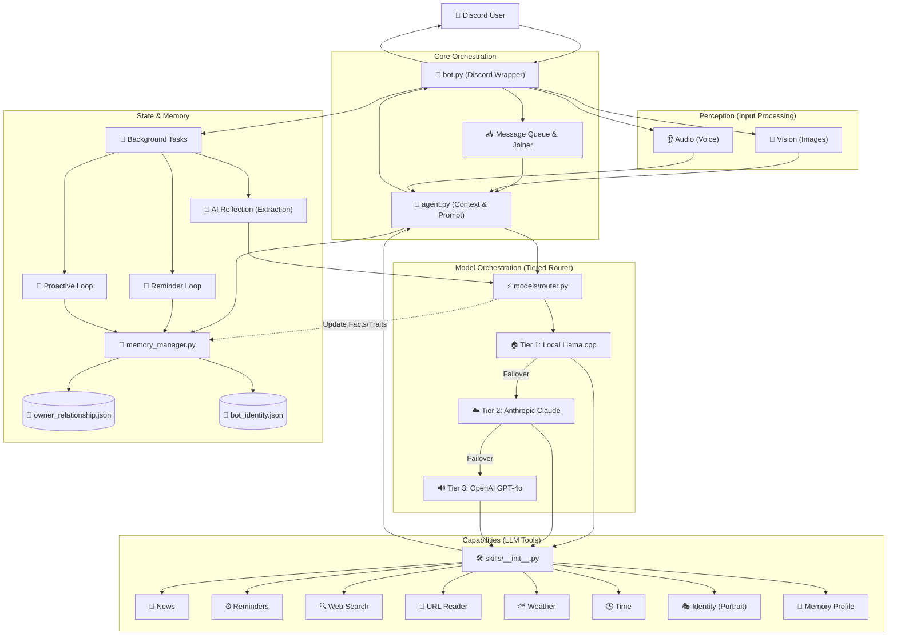

# 🏗️ System Architecture Overview

This diagram visualizes how the bot processes messages, routes between AI models, and manages persistent memory.

### 🗝️ Key Components

| Component | Responsibility |
| :--- | :--- |
| **`bot.py`** | **Ingestion & UI**: Handles Discord connection, message queuing, and **Vision/Audio attachment downloads**. Also runs background loops. |
| **`agent.py`** | **Context & Multi-modal Orchestration**: Gathers memories, formats the system prompt, and prepares media payloads for the Router. |
| **`models/router.py`** | **Tiered Strategy**: Decides which model to use (Llama, Claude, GPT-4o) based on complexity and media types. Handles failovers. |
| **`memory_manager.py`** | Manages in-memory caching and atomic disk writes for the JSON databases, ensuring performance and persistence. |
| **`skills/`** | A modular directory with **8+ core tools**: Time, Weather, Web Search, Identity Moods, News, Reminders, Brain Profile, and Link Reader. |
| **`models/`** | Contains the specific API wrappers and multi-modal processing logic for each provider (Llama, Claude, OpenAI). |
| **`prompts.py`** | Stores the system personality and the proactive outreach logic. |

### 🔄 The Message Flow
1.  **Ingest**: `bot.py` receives and combines rapid messages into a single batch.
2.  **Think**: `agent.py` fetches memory and routes to the best-fit LLM (Llama, Claude, or GPT-4o).
3.  **Act**: The LLM may call a **Skill** (News, Search, etc.) to get real-world data.
4.  **Reflect (Background)**: Once the reply is sent, the bot triggers an **AI Reflection** task. The LLM then "re-reads" the conversation to extract new facts about the owner or adopted bot traits, then calls `update_memory` to commit them to JSON.
5.  **Notify (Background)**: If a **Reminder** is set, a background loop wakes up later and DMs the user independently.
